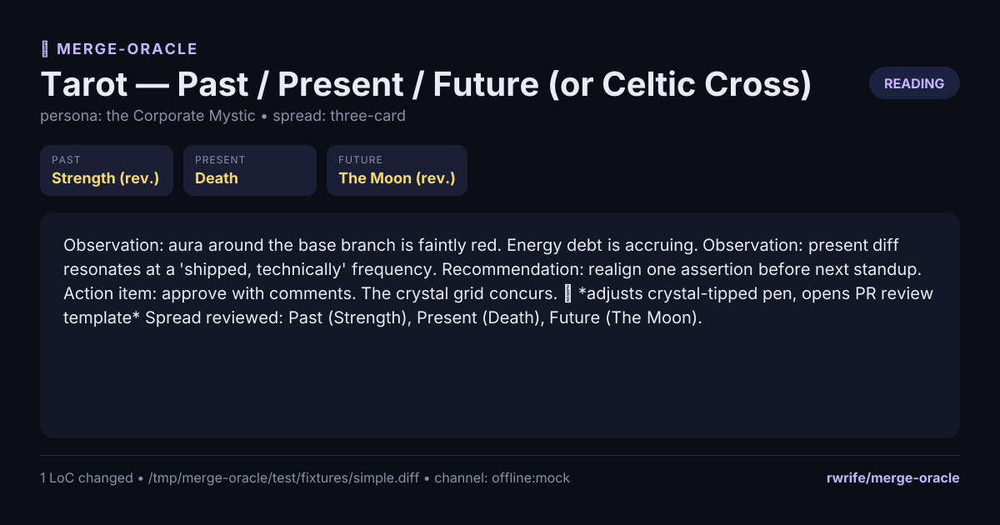

# merge-oracle 🔮

> *"The cards have spoken. This PR shall not merge before Tuesday."*

A mystical CLI oracle that divines the fate of your pull requests via tarot, runes, tea leaves, or I-Ching. Half useful PR review, half theatre — feed it a diff, get back a dramatic ritual reading.

## Status
🌒 Approaching first release. Tarot, runes, tea-leaves, I-Ching, numerology, and astrology methods are wired up end-to-end; npm publish is gated behind the `release` workflow (tag `v*`). See [PLAN.md](./PLAN.md) and [CHANGELOG.md](./CHANGELOG.md).

## Quick taste (planned UX)
```bash
oracle read https://github.com/you/repo/pull/42
oracle read ./feature.diff --method=runes
gh pr diff 42 | oracle read --method=tarot --json
```

## Install

```bash
npm install -g @rwrife/merge-oracle
oracle --version
```

Published from CI on every `v*` tag — see `.github/workflows/release.yml`.

## Local development
Requires Node.js ≥ 18.

```bash
npm ci
npm run build      # compile TypeScript -> dist/
npm test           # run vitest suite
npm run dev hello  # run the CLI directly from src (via tsx)
```

After `npm run build`, you can invoke the CLI as `node dist/cli.js`:

```bash
node dist/cli.js --version
node dist/cli.js hello --name ryan

# load a diff (M2: source loaders)
node dist/cli.js read ./feature.diff
node dist/cli.js read https://github.com/you/repo/pull/42
git diff main | node dist/cli.js read -
node dist/cli.js read ./feature.diff --json
node dist/cli.js read ./feature.diff --offline   # canned mystical drivel, no LLM
node dist/cli.js read ./feature.diff --method=tarot --offline
node dist/cli.js methods                          # list available divination methods
node dist/cli.js methods --json                   # same list, machine-readable
```

### Tarot reading (M4)
The `tarot` method draws three Major Arcana cards (Past / Present / Future) seeded by a SHA-256 hash of the diff, so the same diff always yields the same spread. Cards may land upright or reversed, and the renderer flips reversed cards visually in the ASCII spread.

#### Celtic Cross spread for large PRs
For sizable PRs, tarot offers a full **10-card Celtic Cross** spread (Significator, Challenge, Foundation, Recent Past, Crown, Near Future, Self, Environment, Hopes/Fears, Outcome). It triggers automatically when the diff exceeds the big-PR threshold (default 500 LoC changed), or any time via `--spread=celtic-cross`. Pass `--spread=three-card` to force the classic spread on a big PR.

```bash
# Force the Celtic Cross for any PR size
node dist/cli.js read ./feature.diff --method=tarot --spread=celtic-cross --offline

# Lower the auto-upgrade threshold (also via ORACLE_BIG_PR_THRESHOLD env var)
node dist/cli.js read ./big.diff --method=tarot --big-pr-threshold=200 --offline

# Inspect which spreads each method supports
node dist/cli.js methods --json | jq '.methods[] | {id, supportedSpreads}'
```

### Tea leaves reading
The `tea-leaves` method does not seed cards from a hash — it actually *reads the shape of the diff itself*. A small parser walks the unified diff to count files, additions, deletions, hunk topology, and directories touched; those stats then promote leaf-shapes in the cup (e.g. `mountain` for big diffs, `knife` when deletions dominate, `scales` for balanced add/delete, `web` when many files are entangled). Three shapes settle into **Rim / Side / Bottom** — imminent, present, distant.

```bash
node dist/cli.js read ./feature.diff --method=tea-leaves --offline
```

### Runes reading (M5)
The `runes` method casts three Elder Futhark runes (Situation / Obstacle / Outcome) seeded by a different slice of the diff hash. Reversed runes are read as *merkstave* — their warning meaning.

```bash
node dist/cli.js read ./feature.diff --method=runes --offline
```

### I-Ching reading
The `i-ching` method casts a hexagram from the diff hash — six lines drawn under traditional yarrow-stalk probabilities. Changing lines (old yang / old yin) transform the Primary hexagram into a Derived one, and the oracle reads the transformation as the merge prophecy. Stable casts (no changing lines) read the Primary alone.

```bash
node dist/cli.js read ./feature.diff --method=i-ching --offline
```

### Numerology reading
The `numerology` method reads the *numbers* of a diff — no hash, no LLM trickery in the symbol derivation, just pure arithmetic mysticism. It collects four counts (total churn, files touched, hunks, longest contiguous run of additions) and reduces each via classic digit-sum-mod-9, **preserving master numbers 11 / 22 / 33**. The four resulting digits map to **Life Path / Expression / Soul Urge / Personality** and are woven into a single merge prophecy.

```bash
node dist/cli.js read ./feature.diff --method=numerology --offline
```

### Astrology reading
The `astrology` method casts a three-sign natal chart for the PR itself: **Sun** from the diff's creation timestamp (parsed from a `Date:` header when the diff carries one, else hash-synthesized), **Moon** from the commit author's birthday (`git config user.birthday`, accepted as `YYYY-MM-DD` or `MM-DD` — synthesized deterministically from `user.email` when absent), and **Rising** from the base branch + repo name. Element, modality, and ruling planet are woven into the reading. When the natal date is synthesized rather than configured, the reading discloses this in a `— chart cast from synthesized natal date` footer.

```bash
node dist/cli.js read ./feature.diff --method=astrology --offline

# Opt in to a real natal Moon by setting your birthday once:
git config --global user.birthday 1990-04-15
```

Example offline output:

```
+-------------+   +-------------+   +-------------+
|      ♐      |   |      ♋      |   |      ♊      |
| Sagittarius |   |   Cancer    |   |   Gemini    |
+-------------+   +-------------+   +-------------+

      Sun              Moon             Rising

— chart cast from synthesized natal date
```

### Cursing your repo
Opt-in pre-push hook. `oracle bless --install` writes a tiny `.git/hooks/pre-push` script that pipes your outgoing diff through `oracle bless --check` (pure offline heuristics — no LLM, no network) and aborts the push when the verdict's `severity` meets/exceeds `ORACLE_BLESS_THRESHOLD` (default `8`). Catches the obvious sins: secret-shaped strings in additions (`AKIA…`, `sk-…`, `ghp_…`, PEM keys), removed test files, mass-deletion sprees, `TODO: revert before merge` markers, and absurdly-huge diffs.

```bash
node dist/cli.js bless --install         # writes .git/hooks/pre-push (marker-tagged, idempotent)
node dist/cli.js bless --status          # installed / not-installed / foreign-hook-present
node dist/cli.js bless --uninstall       # removes only the oracle-managed hook
ORACLE_BLESS_THRESHOLD=6 git push        # tighten the threshold per-push
git push --no-verify                     # standard git escape hatch
```

Run `node dist/cli.js bless --check ./some.diff` to preview the verdict without installing anything. `--force` lets `--install` overwrite a non-oracle pre-push hook (and lets `--uninstall` remove one).

### MCP server mode
The oracle can expose itself as an [MCP](https://modelcontextprotocol.io) server over stdio, so Claude Desktop / Cursor / Codex can summon readings inline:

```bash
node dist/cli.js mcp
```

Tools exposed:
- `oracle.read` — divines a PR/diff using a chosen method (`source`, `method?`, `offline?`, `json?`)
- `oracle.methods` — lists available divination methods

Wire format is line-delimited JSON-RPC 2.0 (one request per line). Example Claude Desktop config entry:

```json
{
  "mcpServers": {
    "merge-oracle": {
      "command": "oracle",
      "args": ["mcp"],
      "env": { "OPENAI_API_KEY": "sk-..." }
    }
  }
}
```

For experiments without an LLM key, call `oracle.read` with `"offline": true`.

### GitHub Action — sticky PR readings
The repo also ships a composite GitHub Action so every PR automatically gets a mystical reading posted as a **sticky comment** (updated in place on each push, not re-posted). Drop this into `.github/workflows/merge-oracle.yml` in any repo:

```yaml
on:
  pull_request:
    types: [opened, synchronize, reopened]

permissions:
  contents: read
  pull-requests: write

jobs:
  reading:
    runs-on: ubuntu-latest
    steps:
      - uses: rwrife/merge-oracle@v1
        with:
          method: tarot            # tarot | runes | tea-leaves | i-ching | numerology | astrology
          offline: "false"          # use canned drivel when no LLM is configured
          github-token: ${{ secrets.GITHUB_TOKEN }}
          openai-api-key: ${{ secrets.OPENAI_API_KEY }}
```

A ready-to-copy example lives at [`examples/workflow.yml`](./examples/workflow.yml). Inputs:

| input | default | description |
| --- | --- | --- |
| `method` | `tarot` | Divination method id. |
| `offline` | `false` | If `true`, skip the LLM and use the canned reading. |
| `version` | `latest` | npm version of `@rwrife/merge-oracle` to install. |
| `node-version` | `20` | Node version used by the action. |
| `marker` | `<!-- merge-oracle:sticky -->` | Hidden marker used to find/update the sticky comment. |
| `github-token` | _required_ | Needs `pull-requests: write`. |
| `openai-api-key` / `openai-base-url` / `openai-model` | _empty_ | Passed through as `OPENAI_*` env vars. |

### Personas
Methods choose the *symbols*. **Personas** choose the *voice* that delivers the reading. Same diff, different narrator = different screenshot.

List what's available:

```sh
oracle personas
oracle personas --json
```

Use one for a single reading:

```sh
oracle read ./pr.diff --persona=crone
oracle read ./pr.diff --persona=bard --method=runes
oracle read - --offline --persona=corporate-mystic --json
```

Or set a default for your shell:

```sh
export ORACLE_PERSONA=valley-psychic
```

Shipped personas:

- `default` — the canonical merge-oracle voice (used when no flag/env is set).
- `crone` — ancient, gravelly, fond of warnings.
- `bard` — every reading in rhyming couplets.
- `corporate-mystic` — deadpan PR-review-speak, but with crystals.
- `valley-psychic` — vibes-based, lots of "like" and "literally".
- `shakespearean` — Early Modern English soliloquies.

**Adding your own:** drop a file in `src/personas/` exporting an object with `{ id, name, describe(), systemPrompt, offlineLines(symbols) }`. The registry auto-discovers it the same way methods are discovered. Files starting with `_` and the shared `types.ts` are skipped.

Omitting `--persona` (and `ORACLE_PERSONA`) preserves the historical voice exactly.

### Custom decks
Methods that support pluggable decks (currently `tarot` and `runes`) can draw from any deck registered with the CLI. A **deck** is a small JSON document containing a name, method id, and an array of cards. Bundled decks (`major-arcana`, `elder-futhark`, `i-ching`, `tea-leaves`, `zodiac`) ship inside `src/data/decks/` and are always available.

List registered decks:

```sh
oracle decks
oracle decks --method=tarot
oracle decks --json
```

Use a specific deck for a reading — by registry id or by direct path:

```sh
# bundled default (equivalent — omit --deck)
oracle read ./pr.diff --method=tarot

# BYO deck from disk
oracle read ./pr.diff --method=tarot --deck=./my-thoth.json

# register a whole directory of extra decks, then reference by id
export MERGE_ORACLE_DECKS_DIR=$HOME/oracle-decks
oracle decks
oracle read ./pr.diff --method=runes --deck=younger-futhark
```

Deck JSON schema (v1) — the outer envelope is the same for every method:

```json
{
  "$schema": "https://rwrife.github.io/merge-oracle/deck.schema.json",
  "id": "thoth",
  "name": "Thoth Tarot",
  "method": "tarot",
  "version": 1,
  "cards": [
    {
      "id": "the-fool",
      "name": "The Fool",
      "keywords": ["beginnings", "leap"],
      "upright": "a fresh branch leaps without looking; the journey begins.",
      "reversed": "recklessness; a leap into untested waters."
    }
  ]
}
```

- `method` must match an existing divination method (`tarot`, `runes`). Cards are validated per-method — see the JSON schema at [`docs/deck.schema.json`](docs/deck.schema.json) for the exact card shape each method expects.
- Missing required fields fail fast with a message pointing at the offending card index (e.g. `deck 'my-thoth': card #7 is missing required field(s): reversed`).
- Unknown card fields are silently ignored, so decks can carry extra metadata (art credits, translations) without breaking the loader.
- Env-provided decks may **not** override bundled deck ids (rename to differentiate). Duplicate ids across env files are refused with a warning.

Runnable examples live in [`examples/decks/`](examples/decks/README.md).

### How to add a divination method
Methods are plain TypeScript files in `src/methods/`. The registry auto-discovers any sibling module that exports an object implementing the `DivinationMethod` interface (`id`, `name`, `describe`, `draw`, `readingPrompt`, `render`).

1. Create `src/methods/<your-method>.ts`.
2. Export a `DivinationMethod` (named or default export — both work). Pick a unique `id`.
3. Optionally drop deck data in `src/data/decks/` (it ships to `dist/data/` automatically).
4. Add tests in `tests/<your-method>.test.ts`.
5. `npm run build && node dist/cli.js methods` — your method appears in the list and is usable via `--method=<id>`.

Files starting with `_` and the shared `types.ts` are skipped by discovery.

### Reading history (local SQLite)

Every reading is auto-persisted to `~/.merge-oracle/history.sqlite` (override with `ORACLE_HISTORY_PATH`).
Opt out per-invocation with `oracle read ... --no-history`, or globally with `ORACLE_HISTORY=0`.

```bash
oracle read https://github.com/rwrife/merge-oracle/pull/7  # writes reading #N
oracle history                       # recent readings (filter with --repo/--method/--persona/--limit)
oracle history show 7                # full rendered reading
oracle history stats                 # per-method / per-persona outcome breakdown
oracle verdict 7 --merged            # annotate the outcome (merged|closed|abandoned)
```

Each row records: timestamp, repo/PR (when inferable), diff sha256, method/persona/spread, drawn symbols, rendered text, and outcome. Schema versions upgrade in place on first run.

### Reviewer mood

Adds a short **reviewer weather** aside beneath the main reading, based on each reviewer's recent history on the target repo. Cheap local heuristics only (approval/change-request/comment ratios, mean rounds, top comment keywords, nitpick rate) — no separate LLM call, and the compact JSON blob is folded into the main prompt so the prophecy is aware of who's about to read it.

```bash
# Auto: infer reviewers from the PR (requested reviewers + prior reviews)
oracle read https://github.com/org/repo/pull/42 --with-reviewer-mood

# Manual: specific handles
oracle read PR.diff --with-reviewer-mood=alice,bob

# Skip the network but still render the section (canned mood)
oracle read PR.diff --with-reviewer-mood=alice --offline

# Ignore the 24h cache
oracle read https://github.com/org/repo/pull/42 --with-reviewer-mood --refresh-reviewer-mood

# Scan a wider history window (max 100 closed PRs)
oracle read https://github.com/org/repo/pull/42 --with-reviewer-mood --reviewer-mood-limit=50
```

Example tail:

```
🌗  Reviewer weather
    @alice — 8 approve / 2 changes-requested / 3 commented across scan. Avg 1.5 rounds/PR. Tone: pragmatic. Nitpick rate: low (0.08). Common terms: tests, types, docs.
    @bob   — 3 approve / 6 changes-requested / 4 commented across scan. Avg 2 rounds/PR. Tone: rigorous. Nitpick rate: high (0.42). Common terms: tests, naming, security.
```

The `--json` output gains a `reading.sections.reviewerMood[]` block with the same per-reviewer aggregates, so downstream bots can consume it directly.

**How it works.** Mood aggregates are computed from the last N closed PRs on the repo (default 20, max 100) via `gh api`, cached in the shared history DB (`reviewer_mood` table, 24h TTL, upsert on refresh), and reduced to a compact JSON blob that seeds an extra system message alongside the method prompt. Missing `gh`, no network, or a login with zero prior reviews → the section quietly notes "insufficient signal" and never fails the run. When the flag is omitted, there are zero extra API calls and zero extra tokens in the prompt.

**Privacy.** Only public GitHub logins and aggregate counts (approvals, changes-requested, comments, mean rounds, nitpick rate, top-3 keywords) are stored locally. Review bodies are read to compute keywords/rate and then discarded; they are never persisted to the cache.

### Shareable reading cards (PNG export)

Readings are screenshot bait, but terminal screenshots look ugly across themes. `--png` renders the reading as an OpenGraph-friendly PNG you can drop straight into Twitter/Bluesky/Slack.

```bash
oracle read ./feature.diff --png=./card.png                    # dark, 1200x630 (default)
oracle read ./feature.diff --png=./card.png --png-theme=light
oracle read ./feature.diff --png=./card.png --png-theme=parchment --png-size=1600x840
oracle read ./feature.diff --offline --png=./card.png          # works offline
gh pr diff 42 | oracle read - --png=- > card.png               # `--png=-` streams PNG bytes to stdout
```

Flags:

- `--png <path>` — also write the reading as a PNG card. Use `-` for stdout (in which case the usual text card is suppressed).
- `--png-theme <id>` — `dark` (default), `light`, or `parchment`.
- `--png-size <WxH>` — override dimensions, e.g. `1200x630` (default), `1600x840`, `800x800`. Bounded to `[200, 4096]` per axis.

Cards are rendered with [satori](https://github.com/vercel/satori) (JSX → SVG) and [sharp](https://sharp.pixelplumbing.com/) (SVG → PNG). The bundled Inter font (OFL, `src/data/fonts/`) means no network calls are needed at render time; offline mode produces the same layout as a live reading.



## Advanced rituals

### Oracle duel: comparative reading between two contenders

Sometimes two PRs (or two candidate branches) solve the same problem in different ways and the team has to pick one. `oracle duel` casts a reading for each contender, then delivers a **verdict** — which the cards favor, why, and what the losing contender should carry forward.

```bash
# Duel two PRs from the same repo
oracle duel https://github.com/you/repo/pull/42 https://github.com/you/repo/pull/43

# Duel two local diff files
oracle duel ./approach-a.diff ./approach-b.diff --method=runes --offline

# Bare PR numbers with -R (applies to both sides)
oracle duel 42 43 -R rwrife/merge-oracle --json --offline

# CI bake-off: exit non-zero when the oracle favors the wrong contender
oracle duel ./a.diff ./b.diff --offline --fail-on=favor-b
```

The rendered card lays down: `⚔️ The contenders`, one compact `🃏 Reading` per side, an `⚖️ judgement` paragraph, a `🏆 Verdict` with confidence (`low|medium|high`), and a `🕯️ Carry-forward` bullet for the loser. `--json` returns the same information under `duel.a`, `duel.b`, `duel.verdict`, `duel.rationale`, `duel.carryForward`, plus the raw per-side symbols and readings.

Duels refuse stdin (ambiguous — which side is which?) and refuse identical diffs (the oracle declines to duel a reflection). In `--offline` mode the verdict is deterministic: same two diffs always produce the same result, so it's safe to snapshot in CI.

### Chronicle: meta-readings across many PRs

A single reading is a snapshot; a **chronicle** is a season. `oracle chronicle` composes a meta-reading over a batch of past readings from the local history DB — the last N, a date range, everything in a GitHub milestone, or the whole archive — and returns a single ritual narrative about the repo's arc: recurring omens, the team's mood, and a prophecy for the next release cycle.

```bash
# The last 10 readings in the local history DB
oracle chronicle --last=10

# All merged PRs in a milestone (via `gh api search/issues`; requires --repo)
oracle chronicle --milestone=v0.2 --repo=rwrife/merge-oracle

# A date range (ISO date or full timestamp)
oracle chronicle --since=2026-06-01 --until=2026-07-01

# Every reading ever recorded
oracle chronicle --all

# Combine with a persona for a themed retrospective
oracle chronicle --last=20 --persona=crone --offline

# JSON out for pasting into release notes
oracle chronicle --last=10 --json
```

A rendered chronicle has five sections, each on its own line:

- **⚱️ The gathering** — one-line summary of the cohort (count, dominant method).
- **🕯️ Recurring omens** — the top N symbols (default 3) that showed up across the batch, with an interpretation of what their repetition suggests.
- **🌗 The team's weather** — aggregated reviewer-mood roll-up (warming / mixed / cooling), when reviewer signal is available.
- **📜 The chronicle** — a short narrative arc.
- **🔮 The prophecy** — a single-sentence forecast for the next release cycle.

Flags:

- `--last <n>` / `--since <date>` / `--until <date>` / `--milestone <name>` / `--all` — mutually exclusive selectors.
- `--repo <owner/name>` — restrict to a single repo. Required for `--milestone`.
- `--persona <id>` — narrator persona (see `oracle personas`).
- `--top-omens <n>` — how many recurring omens to highlight (default 3).
- `--offline` — skip the LLM. Returns a deterministic canned narrative that still consumes the *real* aggregates, so the shape stays honest.
- `--json` — machine-readable payload with `chronicle.selection`, `chronicle.omens[]`, `chronicle.weather`, `chronicle.narrative`, `chronicle.prophecy`, plus per-row `consulted[]` metadata for further processing.

When the selection matches zero readings, `chronicle` emits a friendly one-liner and exits 0 — nothing to divine yet, consult the oracle first.

**How it works.** The selector pulls rows from the shared history DB (`~/.merge-oracle/history.sqlite`), an aggregator counts symbol frequencies method-agnostically (any past reading contributes — tarot cards, runes, hexagrams, tea shapes, natal signs, life-path numbers), and the LLM sees only the aggregate, never any specific diff. In offline mode the same aggregate feeds a canned template so the offline output shape matches a live reading.

### LLM configuration (M3)
The oracle calls any OpenAI-compatible chat endpoint. Configure via env vars:

- `OPENAI_API_KEY` — required unless `--offline` is passed
- `OPENAI_BASE_URL` — defaults to `https://api.openai.com/v1`; point at LM Studio, Ollama (`http://localhost:11434/v1`), vLLM, etc.
- `OPENAI_MODEL` — defaults to `gpt-4o-mini`

Without a key, `oracle read` exits 2 and reminds you to either set the key or pass `--offline`.

The `read` command auto-detects the source from the argument shape:
- a GitHub PR URL → shells out to `gh pr view` + `gh pr diff`
- `-` (or empty) → reads piped stdin
- anything else → treated as a path to a `.diff`/`.patch` file

CI runs `npm ci && npm run build && npm test` on every push and PR (see `.github/workflows/ci.yml`).

## License
MIT — see [LICENSE](./LICENSE).
